<div align="center">


# blog-marketing-skills

**Claude Code skills that write and optimize blog posts, then hand you a pull request.**

English · [简体中文](README.zh-CN.md)

[](.claude-plugin/plugin.json)
[](LICENSE)
[](https://claude.com/claude-code)
<br>
[](skills/blog-seo-geo/references/pipeline-playbook.md)
[](https://github.com/marketplace/actions/roadtrip-blog-generator)
[](https://github.com/cazerme/blog-marketing-skills/pulls)

</div>

Claude Code skills that optimize blog posts for **SEO** (Google rankings) and **GEO** (getting cited by AI engines like Gemini). Built on top of the open-source [aaron-marketing](https://github.com/aaron-he-zhu/aaron-marketing-skills) skill pack: this plugin orchestrates its auditing/writing skills and adds a deterministic, fail-closed engine for safely editing your HTML or Markdown files in place.

> Four GitHub Actions + one skill (`blog-seo-geo`) + one agent (`roadtrip-blogger`), plus an optional image pass via [blog-smart-images](https://github.com/Zora-waybox/blog-image-skill). See [Scope](#scope-v04) for exactly what the skill does and refuses to do.

## How it works

```mermaid
flowchart LR
    S([schedule<br/>or manual])

    subgraph GEN["roadtrip-blogger"]
        direction TB
        G[read your site's<br/>publishing convention] --> G2[3-level dedup gate<br/>via .coverage.md]
        G2 --> G3[write the post]
    end

    subgraph OPT["blog-seo-geo"]
        direction TB
        P[parse into blocks<br/>+ mechanical score] --> A1[on-page-seo-checker]
        A1 --> A2[content-writer]
        A2 --> A3[geo-content-optimizer]
        A3 --> A4[serp-markup-builder]
    end

    C{fail-closed<br/>integrity check}

    subgraph IMG["blog-smart-images — optional"]
        direction TB
        I1[plan slots] --> I2[source<br/>licensed only]
        I2 --> I3[score: 8-dim rubric<br/>+ style-fit gate]
        I3 --> I4[insert-only<br/>figures]
    end

    PR[pull request<br/>reports as the body]
    N[nothing written]
    M([you review<br/>and merge])

    S --> G
    G3 --> P
    A4 --> C
    C -->|refuse| N
    C -->|pass| I1
    I4 --> PR
    C -.->|illustrate: false| PR
    PR --> M

    classDef aaron fill:#fef7e0,stroke:#f9ab00,color:#3c4043
    classDef img fill:#e8f0fe,stroke:#1a73e8,color:#3c4043
    classDef stop fill:#fce8e6,stroke:#d93025,color:#3c4043
    classDef done fill:#e6f4ea,stroke:#1e8e3e,color:#3c4043
    class A1,A2,A3,A4 aaron
    class I1,I2,I3,I4 img
    class N stop
    class PR,M done
```



The four amber steps are [aaron-marketing](https://github.com/aaron-he-zhu/aaron-marketing-skills) sub-skills — the editorial judgment. The blue ones are [blog-smart-images](https://github.com/Zora-waybox/blog-image-skill), off unless you set `illustrate: "true"`. Everything else is this plugin's deterministic engine. Nothing is ever pushed to your default branch.

## The roadtrip-blogger agent

Generates one complete, publish-ready **North American road-trip blog post** per run — in your site's own format and voice, and **guaranteed not to duplicate** anything the blog already published:

- Discovers your publishing convention (posts directory, registry/front matter, markup vocabulary) by reading your site, then writes a native-looking post
- A three-level dedup gate backed by a coverage ledger (`<posts-dir>/.coverage.md`): route not re-covered, primary keyword not cannibalized, facts owned by other posts linked instead of restated
- No fabricated specifics: load-bearing facts verified via official sources or written hedged/timeless
- Registers the post per your convention, self-checks with this plugin's mechanical engine, updates the ledger, and hands off — it never commits or deploys

Ask for it in any project where the plugin is installed: *"generate a new roadtrip blog post"* (optionally name a route/keyword), or launch it explicitly as the `roadtrip-blogger` agent. Pair it with `/blog-marketing:blog-seo-geo` on the fresh post for the full generate → optimize loop.

## GitHub Action — scheduled blog generation

This repo is also a GitHub Action: run the roadtrip-blogger agent on a schedule and receive each new post as a **pull request** (never a push to your default branch). Two ways to authenticate (add one as a repo secret):

- **Claude subscription** (Pro/Max): run `claude setup-token` locally and save the token as `CLAUDE_CODE_OAUTH_TOKEN` — runs bill your subscription, no API credits needed
- **API key**: save `ANTHROPIC_API_KEY` — bills Console credits (needs a tier whose input-tokens-per-minute limit fits an agent session; free-tier orgs will hit 429)

Then:

```yaml
# .github/workflows/daily-blog.yml
name: Daily blog post
on:
  schedule:
    - cron: "0 6 * * *"     # one post per day, 06:00 UTC
  workflow_dispatch:          # plus a manual button
permissions:
  contents: write
  pull-requests: write
concurrency:
  group: blog-generation      # never two runs racing the coverage ledger
  cancel-in-progress: false
jobs:
  generate:
    runs-on: ubuntu-latest
    timeout-minutes: 30
    steps:
      - uses: actions/checkout@v4
      - uses: cazerme/blog-marketing-skills@v1
        with:
          claude_code_oauth_token: ${{ secrets.CLAUDE_CODE_OAUTH_TOKEN }}
          # anthropic_api_key: ${{ secrets.ANTHROPIC_API_KEY }}   # the API-billing alternative
          # topic: "icefields parkway itinerary"   # optional; omit to auto-pick
          # working_directory: sites/blog          # optional, for monorepos
```

Inputs: `claude_code_oauth_token` **or** `anthropic_api_key` (one required) · `topic` · `model` · `working_directory` · `create_pr` / `push_branch` · `base_branch` · `github_token`. Outputs: `post_file`, `branch`, `pr_url`.

Each PR carries the agent's handoff report pointer — **review the perishable-claims table before merging** (closures, permits, fees: the facts that go stale). Every run costs real API tokens on your Anthropic account; the schedule above is the cost dial. Commit `<posts-dir>/.coverage.md` to your repo — it is the dedup memory between runs.

### The optimizer action (`/optimize`)

The SEO/GEO optimizer ships as a sub-action in this same repo (GitHub Marketplace lists one action per repo — the generator is the listed one; this one is referenced by path):

```yaml
      - uses: cazerme/blog-marketing-skills/optimize@v1
        with:
          anthropic_api_key: ${{ secrets.ANTHROPIC_API_KEY }}
          post_file: posts/my-post.md
          # keyword: "target keyword"    # optional; derived if omitted
```

It runs the `blog-seo-geo` skill (installing its aaron-marketing dependency on the runner, pinned to the version the skill's playbook was tested against — override with the `aaron_version` input, or set it to `""` for latest), commits **only the post file** (backups/reports stay on the runner — the report becomes the PR body), and is idempotent: an already-optimized post yields `changed: false` and no PR.

### The illustrator action (`/illustrate`)

Text-only posts get images from [Waybox's `blog-smart-images`](https://github.com/Zora-waybox/blog-image-skill) skill — image slots planned from the post's structure, candidates sourced from **licensed inputs only**, each scored against an 8-dimension aesthetic rubric with a style-fit gate, then inserted as hero + section figures. It **never edits prose**: every write is insert-only, `.bak`-backed and fail-closed, which is what makes it safe to run after `blog-seo-geo`.

What lands in the post is plain semantic markup — `<figure><figcaption>` — with **no site-specific classes**. Your page template needs its own rule for it (`figure img{max-width:100%;height:auto}` at minimum); a template that only styles its own hand-authored photo class will render inserted images at their intrinsic width and blow out the column.

```yaml
      - uses: cazerme/blog-marketing-skills/illustrate@v1
        with:
          anthropic_api_key: ${{ secrets.ANTHROPIC_API_KEY }}
          post_file: posts/my-post.md
          pexels_api_key: ${{ secrets.PEXELS_API_KEY }}   # the photo source
          # images_dir: static/blog/<slug>                 # where files land
          # image_src_prefix: /static/blog/<slug>          # how they're referenced
          # image_style: parks-golden-west                 # optional preset
```

**If your posts are template-rendered fragments, set `image_src_prefix`.** By default the skill references images relative to the post file — correct for a Markdown blog where the file and its URL sit at the same depth, and a 404 for a fragment that lives at `blog_posts/x.html` but is served at `/blog/x`. The prefix makes every inserted `src` root-relative instead. A literal `<slug>` in either input is replaced with the post's slug, so one workflow covers every post — which matters in the pipeline, where the post is generated during the run and its slug cannot be written into the workflow at all.

**A stock photo key is effectively required.** With none set, the skill has no photo source, and it refuses to pad a post with text cards — so it leaves slots empty and may insert nothing. [Pexels](https://www.pexels.com/api/) is free (~200/hour) and is the primary source; `unsplash_access_key` is an optional backup whose images carry a mandatory photographer credit (added to the caption automatically).

Both HTML and Markdown posts work, including body fragments. Note that HTML support is not in an upstream release yet, so `image_skill_ref` defaults to `main`; `v0.1.1` and earlier are Markdown-only, and the action fails fast with an explanation rather than silently inserting nothing if you pin it back.

### The full loop: generate → optimize → illustrate → one review

Simplest form — the **pipeline sub-action** does it all in one step and opens a single PR whose body is the optimization report (plus the image report when the image pass runs):

```yaml
      - uses: actions/checkout@v4
      - uses: cazerme/blog-marketing-skills/pipeline@v1
        with:
          anthropic_api_key: ${{ secrets.ANTHROPIC_API_KEY }}
          illustrate: "true"                              # off by default
          pexels_api_key: ${{ secrets.PEXELS_API_KEY }}
```

`illustrate` is off by default because it needs a photo key and spends extra tokens scoring candidates visually. Left off, the pipeline behaves exactly as before and skips the image install entirely.

Or chain the two actions yourself for finer control:

```yaml
      - uses: actions/checkout@v4
      - id: gen
        uses: cazerme/blog-marketing-skills@v1
        with:
          anthropic_api_key: ${{ secrets.ANTHROPIC_API_KEY }}
          create_pr: "false"            # generator leaves a pushed branch
      - uses: actions/checkout@v4
        with: { ref: "${{ steps.gen.outputs.branch }}" }
      - uses: cazerme/blog-marketing-skills/optimize@v1
        with:
          anthropic_api_key: ${{ secrets.ANTHROPIC_API_KEY }}
          post_file: ${{ steps.gen.outputs.post_file }}
          base_branch: ${{ github.event.repository.default_branch }}
```

## What it does

```
/blog-marketing:blog-seo-geo path/to/post.html [target keyword]
/blog-marketing:blog-seo-geo posts/2026-07-08-my-post.md [target keyword]
```

1. Parses your post into content blocks and runs deterministic mechanical checks (title/meta, heading structure, alt text, links…) → baseline score
2. Diagnoses it with `aaron-marketing:on-page-seo-checker`
3. Rewrites content blocks with `aaron-marketing:content-writer` (refresh mode) — facts, links and images are preserved; nothing is invented
4. Runs a **GEO pass** with `aaron-marketing:geo-content-optimizer`: makes key passages quotable by AI engines (Gemini-style citation) and adds answer/FAQ blocks where warranted — restating only what the post already says
5. Builds head markup with `aaron-marketing:serp-markup-builder`: title + meta description are applied to full HTML documents and to markdown front matter; OG/Twitter/JSON-LD land in the report as paste-ready template suggestions
6. Writes the file back **safely**: backups first, then an atomic write that is refused entirely if any link/image/structure would be lost (fail-closed)
7. Emits a report under `.seo-optimizer/reports/`: keyword rationale, what changed and why, resolved issues, mechanical score before/after, template suggestions

All byproducts live in `<input-dir>/.seo-optimizer/` — a dot-directory that static site generators and build tools ignore, so backups and reports can never leak into your published site (and never collide with e.g. Jekyll's `_posts/` scanning). `backups/<name>.original` is your first-ever pre-run copy and is **never overwritten**, no matter how many times you re-optimize; every run also leaves a timestamped pre-write snapshot. Add `.seo-optimizer/` to your `.gitignore` to keep them local (the skill reminds you if it isn't).

### Markdown blogs (Jekyll / Hugo / GitHub Pages)

`.md` posts are first-class input. Front-matter `title:` and `description:` are treated as the post's head: checked, and **edited in place** (missing keys are added to existing front matter). Body optimization works exactly as for HTML — and the parser hard-protects what a rewrite must never touch: **code fences, embedded raw HTML, tables, thematic breaks**. Complex front-matter values (nested lists, multiline) are left alone. Posts without front matter get the fragment treatment below.

### Fragment mode (template-driven blogs)

If your posts are **body fragments** (no `<html>/<head>` — a server or SSG injects them into a page template, e.g. Flask/Jinja/Hugo partials), the skill detects this automatically: body optimization is applied to the fragment file as usual, while every head-level item (title, meta description, canonical, OG/Twitter, JSON-LD) is delivered in the report as paste-ready values with a pointer to where they belong (your template / post registry). Head-level mechanical checks are marked `skipped` instead of failing — they score against your template, not your fragment.

## Install

Requires [Claude Code](https://claude.com/claude-code) and the aaron-marketing plugin:

```
/plugin marketplace add aaron-he-zhu/aaron-marketing-skills
/plugin install aaron-marketing@aaron

/plugin marketplace add cazerme/blog-marketing-skills
/plugin install blog-marketing@blog-marketing-skills
```

Then, inside your blog project:

```
/blog-marketing:blog-seo-geo posts/my-post.html
```

Try it on the bundled sample first: copy `examples/sample-post.html` somewhere and run the command on it.

After `/plugin update blog-marketing`, restart Claude Code (or run `/reload-plugins`) — a session keeps using the previously loaded version until then. The skill states its version at the end of every run summary so a stale cache is immediately visible.

## Scope (v0.4)

| | |
|---|---|
| ✅ Input | A **local HTML or Markdown file** whose article content is in the file — full HTML documents, body fragments, or `.md` posts with YAML front matter (hand-written HTML, Jekyll/Hugo/GitHub Pages sources, server-rendered pages committed to your repo) |
| ✅ Output | The same file, optimized in place; report + never-overwritten original + timestamped snapshots under `.seo-optimizer/`; head-level items for fragments/front-matter-less markdown go to the report, never guessed into the file |
| ✅ Language / engines | English content; SEO for Google, GEO for Gemini-style AI citation |
| ❌ Live URLs | Not supported: there is no "original file" to write back to. Edit the source file in your repo, then deploy |
| ❌ SPA shells / build artifacts | Refused with an explanation — the right edit target is your content source, not compiled output |
| ❌ Technical SEO | Crawling, sitemaps, Core Web Vitals are site-level concerns, out of scope |

## Safety guarantees

- **Write whitelist**: only your input file (after backups land in `.seo-optimizer/backups/`), the report file, and temp files. Nothing else is touched — not even your `.gitignore` (the skill suggests the ignore line; you add it).
- **Fail-closed**: unknown blocks, lost links/images, structural damage, or the file changing mid-run ⇒ the plan is rejected and **nothing is written**.
- **Byte-exact splicing**: unedited regions of your file are byte-identical by construction — the document is never re-serialized. In markdown, code fences and embedded HTML are structurally non-editable.
- **Number guard**: any figure appearing in a rewrite that does not exist somewhere in the original document causes the whole plan to be refused (integers 0–10 exempt, so "eight steps" → "8 steps" still works). Fabricated or digit-transposed statistics cannot reach your file — this is mechanically enforced, not a prompt promise.
- **Coverage honesty**: every run reports what fraction of the visible body text the parser recognized as content blocks; below 70% the report opens with an explicit partial-coverage disclaimer instead of presenting a partial diagnosis as a full one.
- **No fabrication**: rewrites reorganize and tighten what the post already says; new facts, stats, or claims are out of bounds (and for numbers, mechanically refused — see above).
- Scripts are Python stdlib only — no pip installs, no network access.

## About the mechanical score

The score is a deterministic **heuristic baseline** — conventional checks (title length, keyword placement, heading hierarchy, alt text), not a measure of editorial quality. A deliberately unconventional choice (say, a curiosity-driven data-study headline instead of a keyword-led one) can be the right call for your page while costing points here. Treat sub-100 as "worth a look", not "must fix"; the skill itself is instructed to leave strong content alone.

## Roadmap

URL read-only audits, head-markup injection for full documents (OG/Twitter/JSON-LD blocks), image `alt` editing, MDX/setext-heading editability, opt-in secondary write targets (e.g. `--meta-target` for a post registry file).

## Development

```
python3 -m unittest discover tests    # engine round-trip + fail-closed suite
claude plugin validate .              # manifest check
```

## License

MIT. Tested against aaron-marketing 19.1.0 (the actions install that exact upstream version by default — override with the `aaron_version` input).
